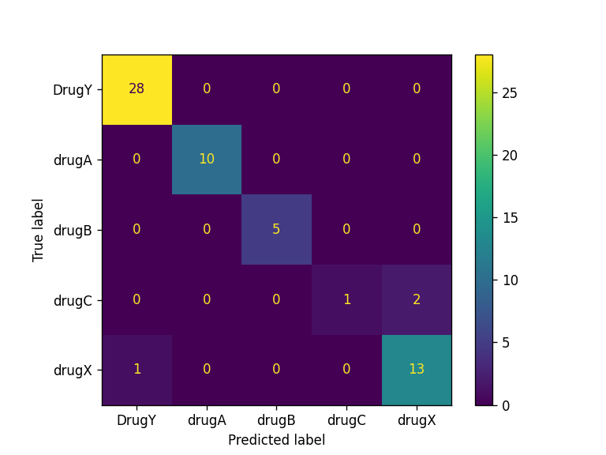

# CICD-for-Machine-Learning
(https://huggingface.co/datasets/huggingface/badges/resolve/main/open-in-hf-spaces-md-dark.svg)](https://huggingface.co/spaces/saumya-patel/Drug-Classification)

## Project Description
In this project, we will be using scikit-learn pipelines to train our random forest algorithm and build a drug classifier. After training, we will automate the evaluation process using CML. Finally, we will build and deploy the web application to Hugging Face Hub. 

From training to evaluation, the entire process will be automated using GitHub actions. 

## Pipeline

## Results
| Model                  | Accuracy | F1 Score |
|------------------------|----------|----------|
| RandomForestClassifier | 97.0%    | 94.0%    |

